# Web Client Set Up and Use

## Installation

To run the project as a web client, follow these steps:

### Open your code editor/IDE:

Assuming you opened the project in your code editor/IDE under Youtube folder, follow the next steps:

### Install dependencies:
```bash
cd youtube
npm install react
npm run build
```

Assuming the server is already running, the application should now be running on [http://localhost:8080](http://localhost:8080).

Please note that the JWT you get when log-in to your account expires within 1 hour. 
After that time, you will not be able to upload, edit or delete anything. You can sign-out and then sign-in again and you will be able to perform these actions.

## Walk-Through - Use the Application

### Home screen

Consists of top 10 most viewed videos and 10 more random videos:
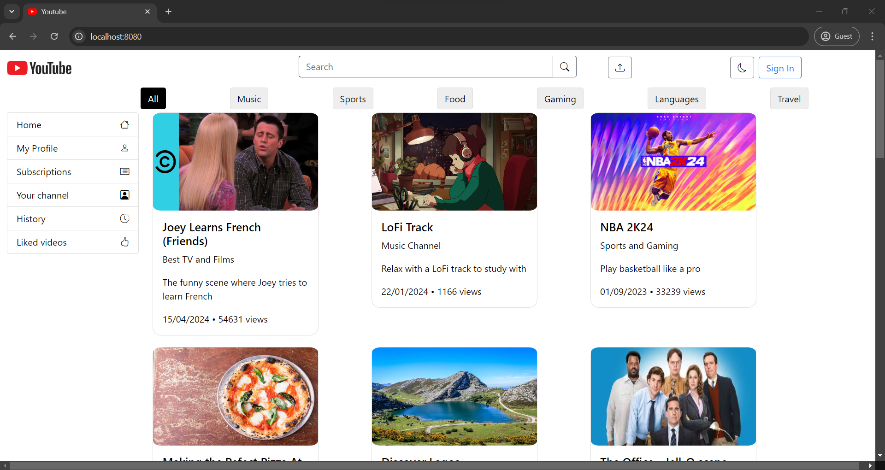

Search for videos using the search bar or the tag buttons:
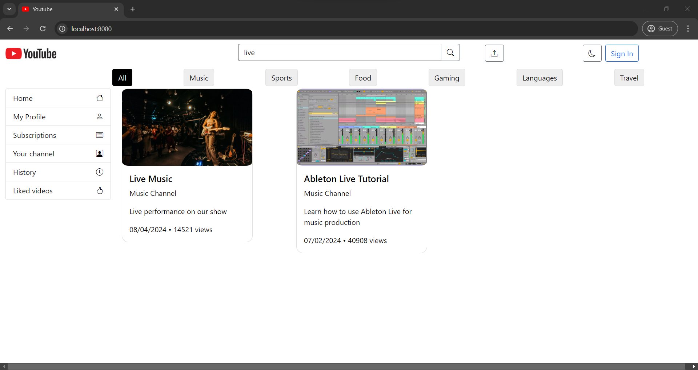

### Register and log-in 

Registration:
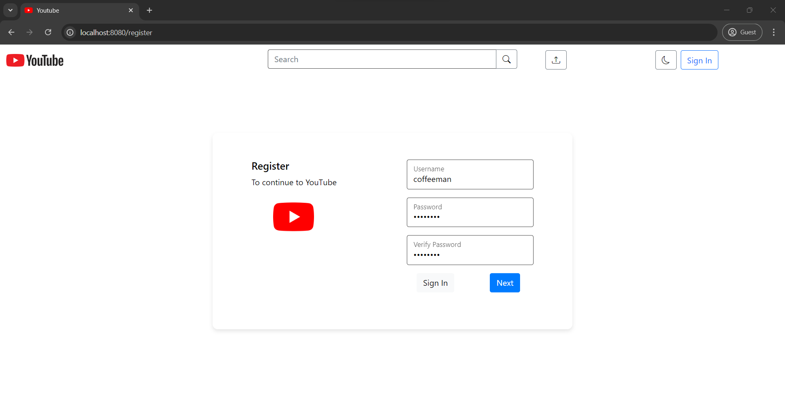
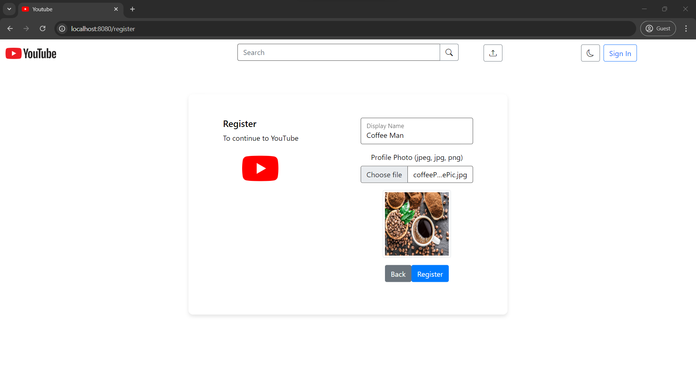

Sign in:
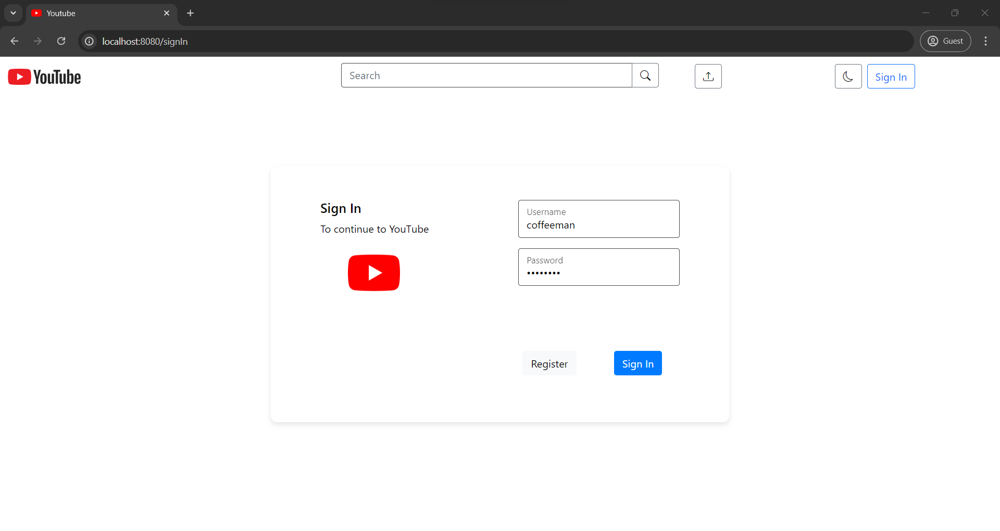

### Upload videos, edit and delete them

Upload video screen:
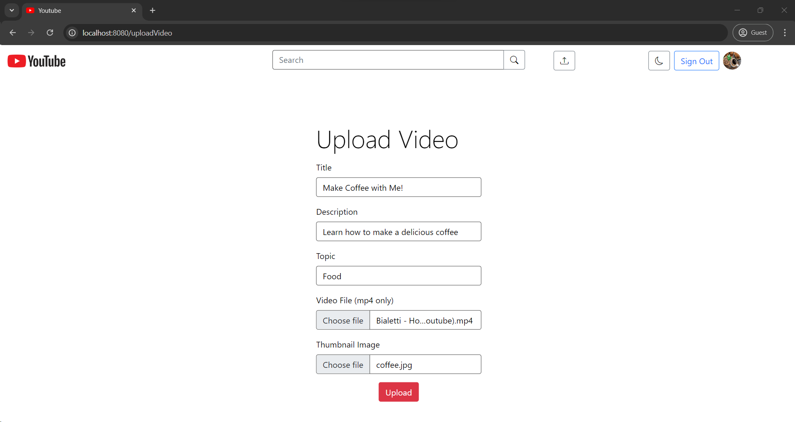

When logged-in as the video's uploader, you can edit the video details or delete your video:
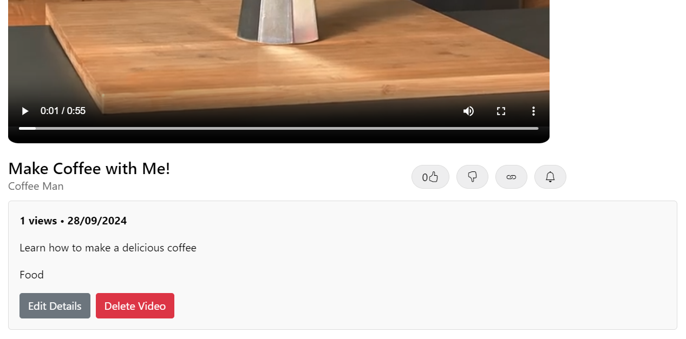
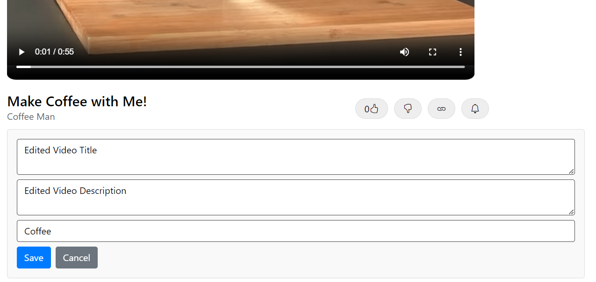
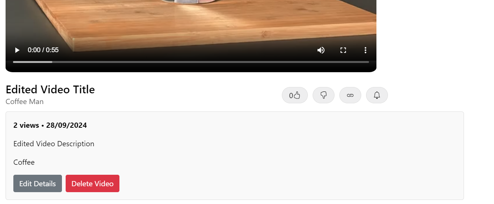

### Watch videos and get recommendations for other videos

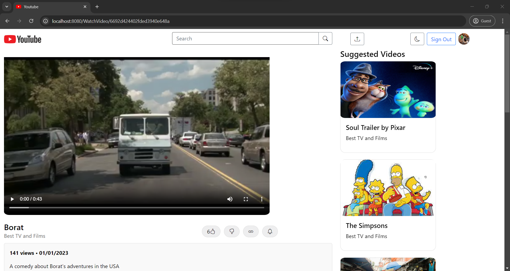

### Leave comments, edit or delete them
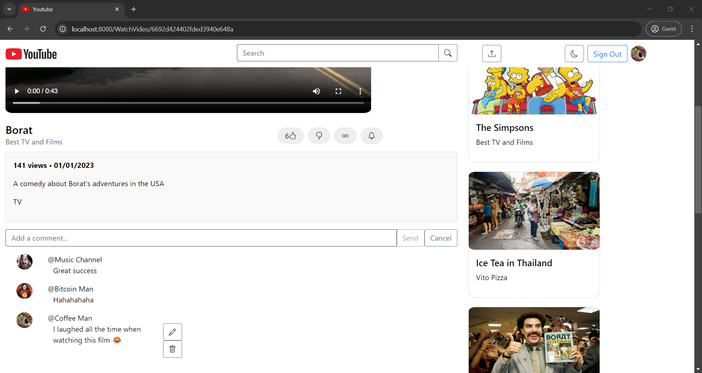

### User profile

When you are logged in, you can click on your profile picture on the right top corner,
see your profile with your videos and change your profile picture and display name:

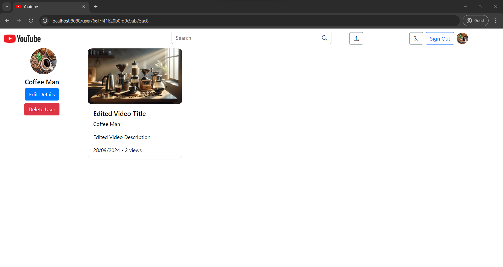

Clicking on some user's username you can visit their profile:
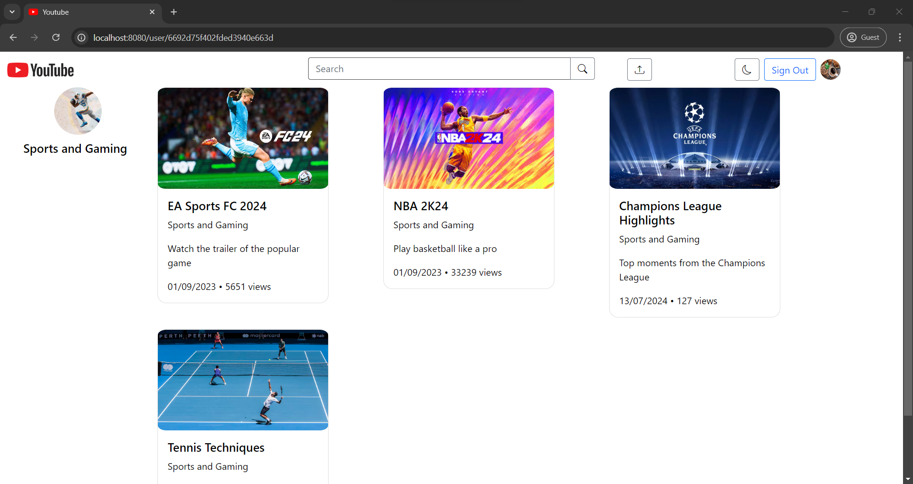

### Dark Mode

Our web application also supports a dark mode theme:

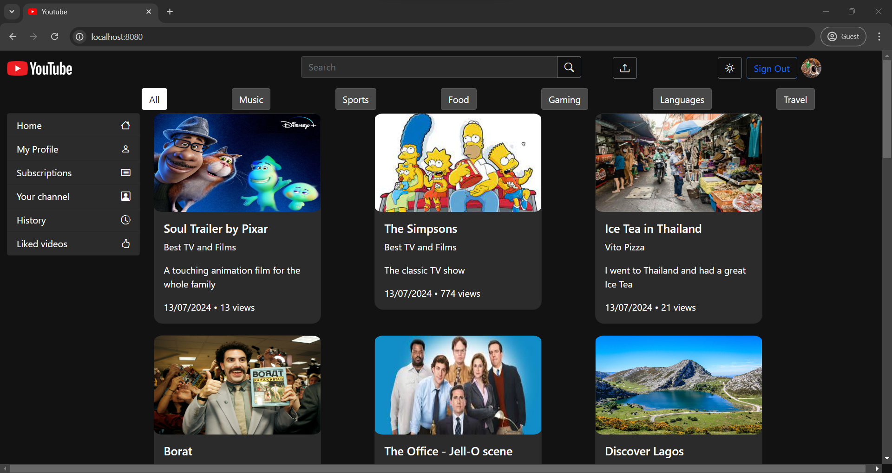
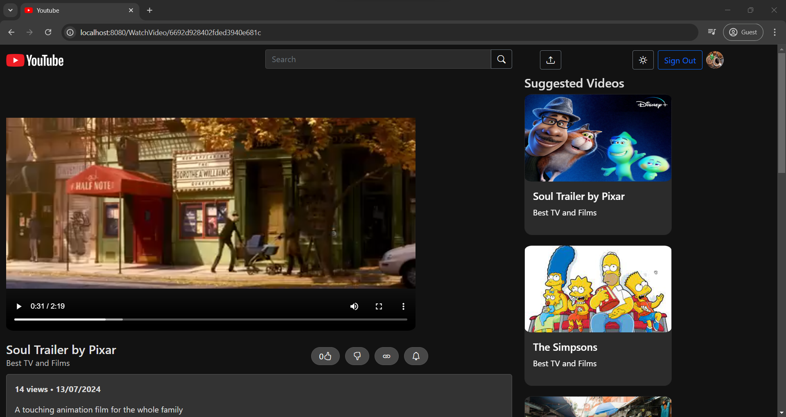
